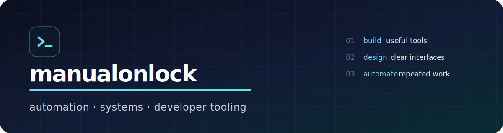

  

  I build practical tools that remove repetitive work, sharpen local workflows,
  and make complex systems easier to operate.

  

## What I work on

- **Automation that survives real use** — OAuth flows, local secret storage,
  delivery deduplication, scheduled agents, and failure-aware integrations.
- **Developer environments** — reproducible terminal, Neovim, shell, and macOS
  setups designed to stay understandable.
- **Systems fundamentals** — networking tools and protocol parsing in Go.

## Selected work

| Project | What it demonstrates |
| --- | --- |
| [**gmail-unread**](https://github.com/manualonlock/gmail-unread) | A tested Python CLI and automation pipeline for multi-account Gmail triage, Telegram delivery, deduplication, local secret storage, and scheduled Codex-powered digests. |
| [**packet-sniffer**](https://github.com/manualonlock/packet-sniffer) | A Go packet-capture tool with Ethernet, ARP, IPv4, and ICMP parsing plus terminal rendering. |
| [**terminal-profile**](https://github.com/manualonlock/terminal-profile) | A portable terminal workspace spanning Neovim, Ghostty, Zsh, shell installers, and prompt configuration. |
| [**macos-profile**](https://github.com/manualonlock/macos-profile) | Scripts and configuration for bootstrapping a productive macOS development environment. |

## Daily setup

| Platform | Shell | Editor | Terminal | Configuration |
| --- | --- | --- | --- | --- |
| macOS / Unix | Zsh | Neovim | Ghostty | [terminal-profile](https://github.com/manualonlock/terminal-profile) |

## Tech stack

### Languages

  
  
  
  

### Data, APIs, and automation

  
  
  
  
  

### Workflow

  
  
  
  
  
  

<strong>Current engineering interests</strong>

 

- Small, composable command-line tools
- Reliable personal automation with explicit failure handling
- Agent-assisted workflows with narrow permissions and structured outputs
- Networking and operating-system fundamentals

---

  Useful software, clear interfaces, fewer repeated steps.

